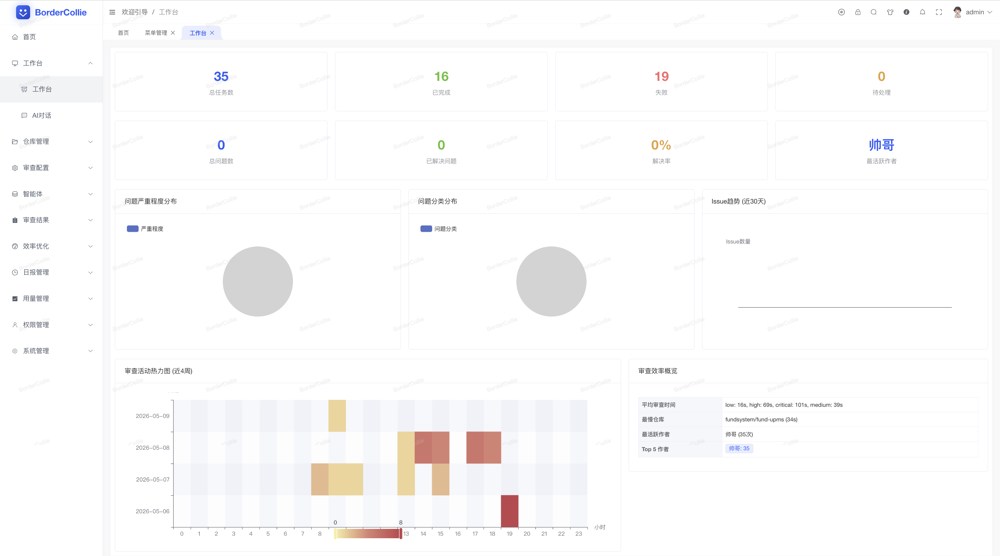
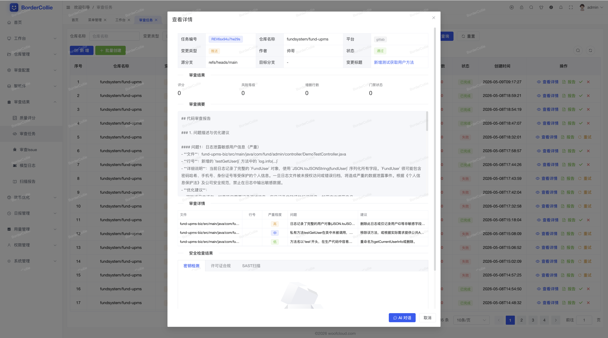
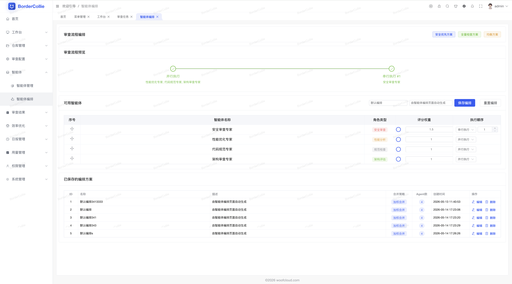
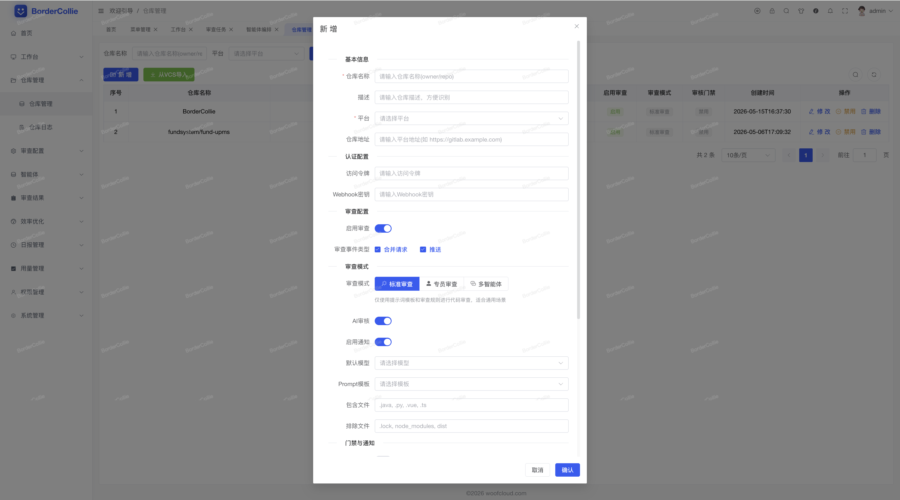
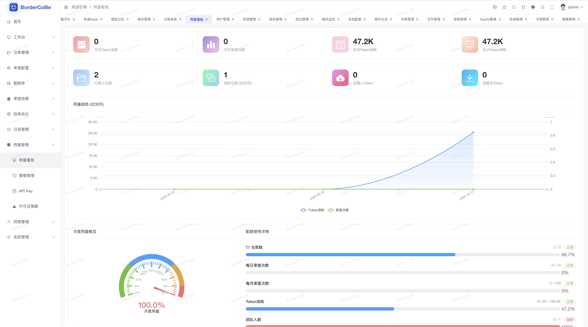

<div align="center">

# collie — BorderCollie CLI

**把分支 / PR 的 diff 提交给 [BorderCollie](https://review.woofcloud.com) 跑一次 AI 评审，命令行版。**

[](https://github.com/woofcloud/border-collie-cli/actions/workflows/cli-release.yml)
[](https://github.com/woofcloud/border-collie-cli/releases/latest)
[](LICENSE)

```bash
$ curl -fsSL https://review.woofcloud.com/install.sh | sh
$ collie login           # 浏览器 device-code 授权
$ collie review          # 自动推断 base / head / repo
```

</div>

<p align="center">
  
</p>

> BorderCollie 是一只 24/7 在线的 AI 代码评审员。每一次 `git push` 后用资深工程师的脑回路读 diff，把 SQL 注入、密钥泄露、依赖许可冲突、低级 bug 全部拦在 merge 之前 —— 平均 2.8 秒给出可应用的修复建议。
>
> 主战场是控制台（<https://review.woofcloud.com/admin>），`collie` 是你**在本地或 CI 里也能跳进来**的那条命令行入口。

> ⚠️ 命令名是 `collie`，不是 `bc` —— Unix 自带的 `bc` 是 GNU 计算器，会撞名。`collie` 这只边牧专为你看代码而生。

---

## 它解决什么问题

| 场景 | 痛点 | `collie` 给你的姿势 |
|---|---|---|
| **push 之前** | 不知道这把 diff 会不会被 CI 打回；reviewer 也烦小问题 | `collie review` 在本地跑一次，先把 reviewer 该揪的东西揪出来 |
| **CI 接入** | 配 webhook / 配 token / 装 Action，每个 repo 都来一遍 | 一行 `collie review --format md` 就能贴 PR；`exit 2` 自动 fail pipeline |
| **多模型 + 多 agent** | 想换 LLM / 跑多个 agent 还要去翻配置 | 在控制台里点几下，CLI 跑评审时自动用 |

---

## 60 秒上手

### 1. 安装

```bash
curl -fsSL https://review.woofcloud.com/install.sh | sh
```

脚本会探测你的 OS / arch，从 [GitHub Release](https://github.com/woofcloud/border-collie-cli/releases/latest) 拉对应平台二进制，校验 sha256，落到 `~/.local/bin/collie`。

### 2. 登录

```bash
$ collie login
▸ open the URL in your browser and confirm the code:
    https://review.woofcloud.com/cli/device
    code: BDRWC-G34
  waiting…
```

打开提示的 URL，已登录控制台的话直接看到验证码确认页；点「授权 collie CLI」，终端马上拿到 token。

### 3. 评审

进任意一个 git 仓库，跑：

```bash
$ collie review
```

零参数。`collie` 会按这个顺序自己推断：

| 字段 | 推断顺序 |
|------|------|
| `repo` | `--repo` → `BC_REPO` 环境变量 → `git remote.origin.url` 解析 → 当前目录名 |
| `base` | `--base` → 当前分支 upstream → `origin/main` → `origin/master` → `origin/develop`（远端实存的第一个） |
| `head` | `--head` → `HEAD` |

结果直接打在终端：风险等级、score、findings 列表 + 每条的 severity 与文件位置。

---

## 控制台还能看什么

CLI 是 BorderCollie 的「开发者快捷入口」。日常运营、深入排查、Agent 编排、配额查看，都在控制台里。

<p align="center">
  
</p>

<p align="center">
  
</p>

<p align="center">
  
</p>

<p align="center">
  
</p>

控制台地址：<https://review.woofcloud.com/admin>。CLI 跟控制台共享同一份租户、API Key、模型与 Agent 配置 —— 你在哪儿改都即时生效。

---

## 安装的几种姿势

### 一行脚本（推荐：macOS / Linux）

```bash
curl -fsSL https://review.woofcloud.com/install.sh | sh
```

可调环境变量：

| 变量 | 默认 | 作用 |
|---|---|---|
| `BC_INSTALL_DIR` | `~/.local/bin` | 安装目录 |
| `BC_VERSION` | (latest) | 指定历史版本，例如 `cli-v2.0.0` |
| `BC_RELEASE_REPO` | `woofcloud/border-collie` | release 源仓（fork 自托管用） |

### Windows

到 [Releases](https://github.com/woofcloud/border-collie-cli/releases/latest) 下载 `collie-x86_64-pc-windows-msvc.zip`，解压后把 `collie.exe` 放进 PATH。

### 从源码构建

```bash
git clone https://github.com/woofcloud/border-collie-cli.git
cd border-collie-cli
cargo install --path .
```

需要 Rust 1.74+，安装出来的二进制名叫 `collie`。

---

## CI 集成

### GitHub Action

```yaml
- uses: actions/checkout@v4
  with: { fetch-depth: 0 }      # 需要 base..head 的历史
- run: |
    curl -fsSL https://review.woofcloud.com/install.sh \
      | BC_INSTALL_DIR=$RUNNER_TEMP/bin sh
- run: $RUNNER_TEMP/bin/collie login --non-interactive --key ${{ secrets.BC_API_KEY }}
- run: $RUNNER_TEMP/bin/collie review --base origin/${{ github.base_ref }} --format md --out review.md
- if: always()
  uses: actions/upload-artifact@v4
  with: { name: collie-review, path: review.md }
```

退出码语义：

| 码 | 含义 | pipeline 表现 |
|---|---|---|
| `0` | 通过 | 绿 ✓ |
| `2` | blocked（风险超阈值） | 红 ✗，pipeline fail |
| `3` | failed（评审本身报错） | 红 ✗，pipeline fail |
| `4` | 网络 / 接口异常 | 红 ✗（建议加 retry） |
| `1` | 参数 / 配置错 | 红 ✗ |

### GitLab CI

```yaml
review:
  image: ubuntu:22.04
  before_script:
    - apt-get update && apt-get install -y curl git
    - curl -fsSL https://review.woofcloud.com/install.sh | sh
    - export PATH=$HOME/.local/bin:$PATH
    - collie login --non-interactive --key "$BC_API_KEY"
  script:
    - collie review --base "origin/$CI_MERGE_REQUEST_TARGET_BRANCH_NAME" --format md --out review.md
  artifacts:
    paths: [review.md]
    when: always
```

---

## 命令一览

| 类别 | 命令 |
|---|---|
| 身份 | `collie login` / `collie logout` / `collie whoami` |
| 本地评审 | `collie review [--base ... --head ... --repo ...]` |
| 任务 | `collie status <id>` / `collie result <id>` / `collie list` / `collie retry <id>` |
| 服务端拉取 | `collie review-branch --repo <name> --branch <br>` |
| 仓库 | `collie repo {list,add,rm,toggle}` |
| 模型 | `collie model {list,add,rm,use,show}` |
| Agent | `collie agent {list,add,rm,toggle}` |
| 审核员 | `collie reviewer {list,add,rm}` |
| 配额 | `collie usage` / `collie plans` / `collie logs` |
| 升级 | `collie upgrade [--check\|--run]` |
| 杂项 | `collie config` / `collie completion <shell>` / `collie init`（CI 别名） |

`collie --help` 看全部；`collie <subcommand> --help` 看每个子命令的具体参数。

---

## 配置

落地在 `~/.bordercollie/config.toml`（macOS / Linux 自动 `chmod 600`）：

```toml
api = "https://review.woofcloud.com"
key = "bc_…"
```

环境变量优先级高于 config 文件：

| 变量 | 作用 |
|---|---|
| `BC_API` | 覆盖服务器地址 |
| `BC_API_KEY` | 覆盖 API Key（CI 友好） |
| `BC_REPO` | 覆盖默认仓库名 |
| `BC_RELEASE_REPO` | 自更新源仓 |
| `BC_INSTALL_URL` | 自更新所用的 install.sh URL |

---

## 升级

```bash
collie upgrade              # 查看 latest（不下载）
collie upgrade --run        # 调 install.sh 替换当前二进制
```

`collie` 不会在每次启动时悄悄连网检查更新 —— 升级是你主动触发的事。

---

## 后端协议（CLI 与服务端约定）

CLI 与服务端通信走 `X-API-Key` header，所有 CLI 端点都在 `/api/v1/cli/**` 下：

| 端点 | 用途 |
|---|---|
| `POST /api/v1/cli/device/code` | `collie login`：申请 device + user code |
| `POST /api/v1/cli/device/poll` | `collie login`：轮询授权状态 |
| `DELETE /api/v1/cli/device/token` | `collie logout`：自吊销当前 API Key |
| `GET  /api/v1/cli/whoami` | `collie whoami` |
| `POST /api/v1/cli/review/submit` | 本地 diff 提交评审 |
| `POST /api/v1/cli/review/branch` | 让服务端拉 base..branch 跑评审 |
| `GET  /api/v1/cli/review/{status,result,list}` | 任务查询 |
| `POST /api/v1/cli/review/:id/retry` | 重试失败任务 |
| `/api/v1/cli/{repo,model,agent,reviewer}/...` | 管理类（控制台同源） |
| `GET  /api/v1/cli/{usage,plans,logs/page}` | 配额 + 套餐目录 + 模型调用日志 |

device-code OAuth 的批准端点不在 `/cli/**` 下：`POST /api/v1/review/cli-device/approve`（走 JWT，由控制台 `/cli/device` 页调用）。

---

## 开发 / 构建 / 发布

```bash
cargo build               # debug
cargo build --release     # 产物在 target/release/collie
cargo test                # unit tests
cargo fmt && cargo clippy
```

打 `cli-v*` tag 即触发 [cli-release.yml](.github/workflows/cli-release.yml) —— 5 矩阵（linux/macos × x86_64+aarch64，windows x86_64）自动构建 + 上传 sha256 + 创建 GitHub Release。`review.woofcloud.com/install.sh` 默认拉 latest。

```bash
# 发新版本
# 1. bump Cargo.toml::version
# 2. cargo build → Cargo.lock 也跟着更新，一起 commit
# 3. git tag cli-v2.0.1 && git push origin cli-v2.0.1
```

---

## 已知约束 / 路线图

- macOS / Linux 一脚本安装；Windows 暂走手动下载 + 加 PATH（Scoop 在路上）
- 浏览器 device-code 登录要求服务端 ≥ 2.0；老服务端用 `collie login --non-interactive --key …`
- `collie review --apply` 交互式 patch 勾选在 2.0.x 后续版本中提供
- crossterm 全屏 TUI 状态机（spinner + finding 表 + diff 视图）规划中

---

## License

[Apache-2.0](LICENSE) © Woof Cloud
